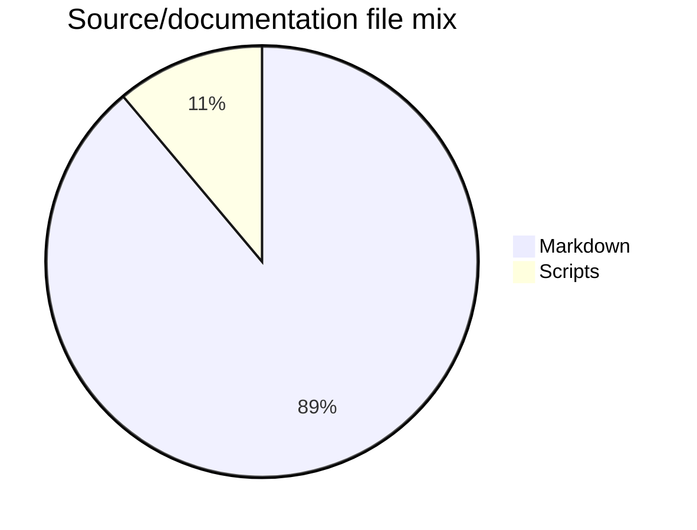

# Project Snapshot

Generated from the repository tree for public README/maintenance polish. Counts exclude `.git`, dependency folders, and build outputs.

## File Mix

- Markdown: 8 files
- JavaScript validation scripts: 1 file
- GitHub workflow/templates: present

```mermaid
pie title Source/documentation file mix
    "Markdown" : 8
    "Scripts" : 1
```

## Maintenance Checklist

- Root SKILL.md uses the shared Claude/Codex package format.
- README describes purpose, setup, usage, validation, and limitations.
- SECURITY.md explains vulnerability and secret handling.
- Issue and PR templates are available.
- CI runs `node scripts/validate-skill.mjs`.
